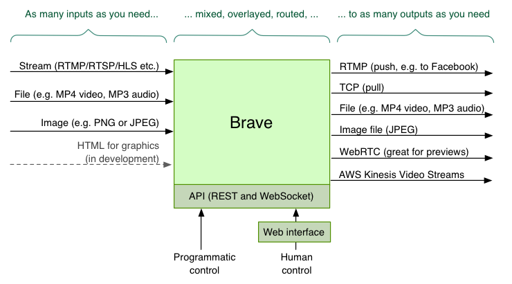
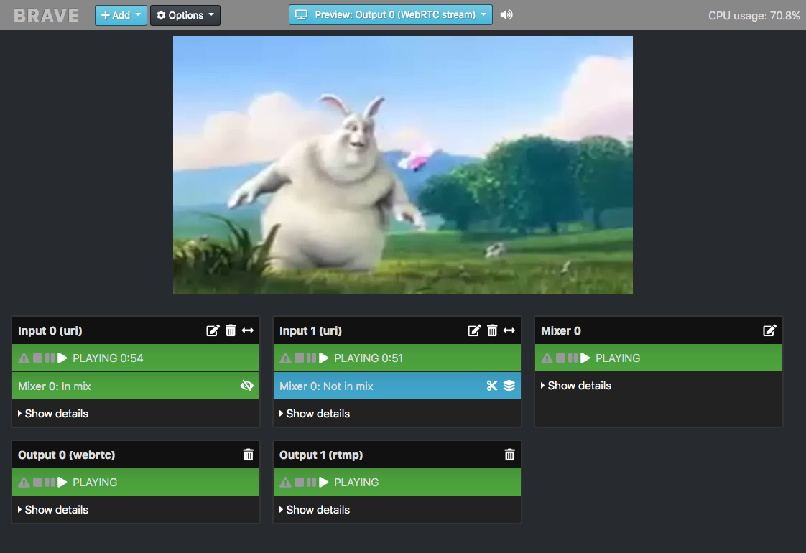

# Brave

[](blob/master/LICENSE)


_This project is an open-source prototype. See 'Project status' and 'License' below for more._

Brave is a *B*asic *r*eal-time (remote) *audio/video* *e*ditor.
It allows *LIVE* video (and/or audio) to be received, manipulated, and sent elsewhere.
It is API driven and is designed to work remotely, such as on the cloud.

Example usage includes:

* Forwarding RTMP from one place to another
* Changing the size of video, and having a holding slate if the input disappears
* Mixing two or more inputs
* Adding basic graphics (images, text, etc)
* Previewing video streams using WebRTC

Brave is based on GStreamer. It is, in one sense, a RESTful API for GStreamer (for live audio/video handling).

To learn more, read below, or see the [FAQ](docs/faq.md), [API guide](docs/api.md), [How-to guide](docs/howto.md) and [Config file guide](docs/config_file.md).

### Architecture diagram


### Web interface screenshot


This web interface is optional; Brave can be controlled via the API or startup config file.

### Alternatives to consider
Similar open-source projects to this include:

* [OBS](https://obsproject.com/)
* [Voctomix](https://github.com/voc/voctomix)
* [Snowmix](https://snowmix.sourceforge.io/)
* [FFdynamic](https://github.com/Xingtao/FFdynamic)

## Capabilities
Brave allows you to configure *inputs*, *outputs*, *mixers* and *overlays*. You can have any number of each (subject to the limitations of your server). They can be created at startup using a [config file](./docs/config_file.md), or created and changed dynamically via [REST API](docs/api.md).

### Inputs
An input is a source of audio or video. There can be any number of inputs, added or removed at any time, which can then be sent to mixers and outputs. Input types include:

* Live and non-live streams, through protocols such as RTMP, RTSP, and HLS
* Files (e.g. mp4 or mp3) - either local or downloaded remotely
* Images (PNG/SVG/JPEG)
* MPEG or OGG retrieved via a TCP connection
* Test audio / video streams

[Read more about input types.](docs/inputs.md)

### Outputs
An output is how the constructed audio/video is then sent, served or saved. There can be any number of outputs, added or removed at any time. Output types include:

* RTMP - which can then send to Facebook Live and YouTube Live
* TCP Server - which clients such as VLC can connect to
* Local file - writing an mp4 file
* Image - writing a JPEG file of the video periodically
* WebRTC - for near-realtime previewing of the video (and audio)
* [AWS Kinesis Video Stream](https://aws.amazon.com/kinesis/video-streams/)
* Local - for playback on a local machine

[Read more about output types.](docs/outputs.md)

### Overlays
An overlay is something that can overlay the video from an input or mixer. (Overlays do not exist for audio.) There can be any number of overlays.

Supported overlay types:

* Clock (place a clock over the video)
* Text (write text over the video)
* Effects

[Read more about overlay types.](docs/overlays.md)

### Mixers
There can be any number of mixers. They can take any number of inputs (including the output from another mixer). It can send to any number of outputs. [Read more about mixers.](docs/mixers.md)

## Project status
This project is still work in progress, and has not been thoroughly tested or used any any production environments.

## Installation
First, install the dependencies, and then clone this repo.

### Dependencies
* Python 3.6 (or higher)
* GStreamer 1.14.3 or higher (including the good/bad/ugly packages)
* Multiple Python libraries (installed by pipenv)

### Install guides
* [How to install on MacOS](./docs/install_macos.md)
* [How to install on Ubuntu](./docs/install_ubuntu.md)
* [How to install on CentOS 7](./docs/install_centos7.md)

### Docker build and install and use
`docker build https://github.com/DoxIsMightier/brave.git`

Then get the package id from the end of the build process:
`Successfully built PackageHashNumber`

Then run the new docker image:
`docker run --name brave --rm -t -i -p 5000:5000 PackageHashNumber`

Optionally you can also mount a local directory interal to the docker instance:
`-v /path/in/host:/videos`

## How to use
To start:

```
./brave.py
```

Brave has an [API](docs/api.md) and web interface, which by default is on port 5000. So if running locally, access by pointing your web browser at:

```
http://localhost:5000/
```

To change the port, either set the `PORT` environment variable, or set `api_port` in the config file.


### Configuring inputs, outputs, overlays and mixers
There are three ways to configure Brave:

1. Web interface
2. [REST API](docs/api.md) (plus optional websocket)
3. [Config file](./docs/config_file.md)

#### Web interface
The web interface is a simple client-side interface. It uses the API to allow the user to view and control Brave's setup.

The web interface can be found at [http://localhost:5000/](). (If running on a remote server, replacing `localhost` with the name of your server.)

#### API
The API allows read/write access of the state of Brave, including being able to create new inputs, outputs, and overlays dynamically. See the [API documentation](docs/api.md) for more.

#### Config file
Brave can be configured by config file.
This includes being able to have certain inputs, mixers, outputs and overlays created when Brave starts.

Provide another config with the `-c` parameter, e.g.

```
./brave.py -c config/example_empty.yaml
```

See the [Config File documentation](./docs/config_file.md) for more.

#### STUN and TURN servers for WebRTC
A STUN or TURN server is likely required for Brave's WebRTC to work between remote connections.
Brave defaults to Google's public STUN server; this can be overridden in the [config file](./docs/config_file.md), or by setting the `STUN_SERVER` environment variable. Likewise, a `TURN_SERVER` environment variable can be set if a TURN server is required. Its value should be in the format `<usernane>:<credential>@<host>:<port>`.

## Tests
Brave has functional black-box tests that ensure the config file and API is working correctly.
To run them:

```
pytest
```

A few useful `pytest` options:

* To see the output, add `-s`.
* To see the name of each test being run, add `-v`.
* To run only failing tests, add `--lf`.
* To filter to tests that match a string: `-k <string_to_match>`

All tests should pass.

### Code quality (linting)
To check code quality, [Flake8](http://flake8.pycqa.org/en/latest/index.html) is used. To run:

```
flake8 --count brave
```

## Debugging
Brave is based on GStreamer, which is a complex beast. If you're experiencing errors or reliability issues, here's a guide on how to debug.

### Run the tests
Run the test framework.

### Logging
Brave outputs log messages, which should include all errors. To see finer grained logging, set `LOG_LEVEL=debug`, i.e.

```
LOG_LEVEL=debug ./brave.py
```

For even more, ask GStreamer to provide much more debug output with:

```
GST_DEBUG=4 LOG_LEVEL=debug ./brave.py
```

### Analyse the elements
Brave creates multiple GStreamer pipelines, each containing multiple linked elements.
Spotting which element has caused an error can help track down the problem.

To see, select 'Debug view' from the web interface. Or, visit the `/api/elements` API endpoint.

Look out for:

* Elements not in the PLAYING state
* Elements with different caps

If there are situations where it work and where it doesn't, try capturing the two `/elements` responses, and diffing them.

### Switch off audio or video
If you're manipulating video that has audio, try disabling audio using `enable_audio: false` in the config file.

And then similarly, disabling video using `enable_video: false`.

This will help inform if it's the audio handling or video handling that's at fault.

### Divide and conquer
If you repeatably get an error, identify what's causing it by removing inputs/outputs/overlays until the problem goes away. Try and find the minimum required to cause the problem.

## License
Brave is licensed under the [Apache 2 license](blob/master/LICENSE).

Brave uses GStreamer which is licensed under the LGPL. GStreamer is dynamically linked, and is not distributed as part of the Brave codebase. [Here is the GStreamer license.](https://github.com/GStreamer/gstreamer/blob/master/COPYING) [Here is the GStreamer licensing documentation.](https://gstreamer.freedesktop.org/documentation/licensing.html)

Copyright (c) 2019 BBC
