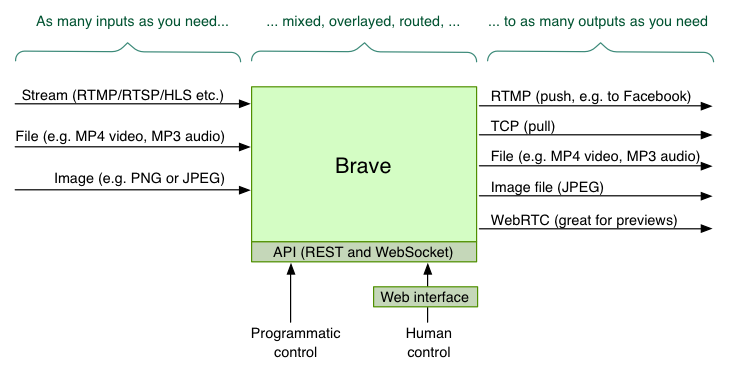

# Brave

_This project is an open-source prototype. See 'Project status' and 'License' below for more._

Brave is a *B*asic *r*eal-time (remote) *audio/video* *e*ditor.
It allows *LIVE* video (or audio) to be received, manipulated, and sent elsewhere.
It is API driven and is designed to work remotely, such as on the cloud.

Example usage includes:

* Forwarding RTMP from one place to another
* Changing the size of video, and having a holding slate if the input disappears
* Mixing two or more inputs
* Adding basic graphics (images, text, etc)
* Previewing video streams using WebRTC

Brave is based on GStreamer. It is, in one sense, a RESTful API for GStreamer (for live audio/video handling).

### Architecture diagram


### Web interface screenshot


This web interface is optional; Brave can be controlled via the API or startup config file.

### Alternatives to consider
Similar open-source projects to this include:

* [OBS](https://obsproject.com/)
* [Voctomix](https://github.com/voc/voctomix)
* [Snowmix](https://snowmix.sourceforge.io/)
* [FFdynamic](https://github.com/Xingtao/FFdynamic)

## Capabilities
Brave allows you to configure *inputs*, *outputs*, *mixers* and *overlays*.
You can have any number of each (subject to the limitations of your server).
The exception is that, at present, you can only have one mixer.

### Inputs
An input is a source of audio or video.

Supported input types:

* An RTMP, RTSP, and HLS streams
 * The GStreamer element [Playbin](https://gstreamer.freedesktop.org/data/doc/gstreamer/head/gst-plugins-base-plugins/html/gst-plugins-base-plugins-playbin.html) is used, so anything it supports can be requested
 * Note that Brave does not act as a server for accepting these requested. They must be 'pulled' from another place. In other words, if you had a video source that wanted to send RTMP, you'd require an RTMP server to accept this so that Brave could then read it.
* A file (e.g. an MP3 audio file or an MP4 video file)
 * This can be either local (on the server) or remote (downloaded via HTTP)
 * The formats supported will depend on the codecs installed on your server.
 * Again, `Playbin` is used (for those who know GStreamer)
* A PNG/SVG/JPEG image
 * This will then be 'held' on the video stream
* Test audio / video
 * For video, there are multiple types, including color bars and a bouncing ball.
 * For audio, this is a single tone (frequency variable).

Inputs can be resized.

### Outputs
An output is how the constructed audio/video is then sent, served or saved.

There can be any number of outputs.

Supported output types:

* RTMP
 * Sends an RTMP live stream to an external location
 * This works with Facebook Live and YouTube Live
* TCP
 *  Brave acts as a server to allow a client, such as VLC, to receive the AV over TCP)
* Write to file
 * File is written on the local server.
* Image
 * Writing of a JPEG file every second
* WebRTC
 * For near-realtime previewing of the video (and audio)
* Local playback
 * For video, a window appears to view the video
 * Because Brave has been designed to work remotely

### Overlays
An overlay is something that can overlay the mixed video. (Overlays do not exist for audio.)

There can be any number of overlays.

Supported overlay types:

* Clock (place a clock over the video)
* Text (write text over the video)
* Effect (Use one of the [effecttv](https://gstreamer.freedesktop.org/data/doc/gstreamer/head/gst-plugins-good/html/gst-plugins-good-plugins-plugin-effectv.html) effects on the video)

### Mixer
At present there is always 1 mixer. It can take any number of inputs.
It can send to any number of outputs.

## Project status
This project is still work in progress, and has not been thoroughly tested or used any any real environments.

## Installation
First, install the dependencies, and then clone this repo.

### Dependencies
* Python 3.6 (or higher)
* GStreamer 1.14.3 or higher (including the good/bad/ugly packages)
* Python libraries from pip:
 * To run: `pyyaml gbulb sanic websockets psutil`
 * In addition, to test: `pytest`
* The GStreamer Python libraries
* IF you want to send or receive RTMP: librtmp and openh264

### How to install the dependencies
* On MacOS, see [How to install on MacOS](./docs/install_macos.md)
* On CentOS 7, see [How to install on CentOS 7](./docs/install_centos7.md)
* On Ubuntu/Debian, it should be possible to install all depedencies using APT. (Though at the time of writing, you'll need to use _unstable_ to get GStreamer 1.14)


## How to use
To start:

```
./brave.py
```

Brave has an API and web interface, which by default is on port 5000. So if running locally, access by pointing your web browser at:

```
http://localhost:5000/
```

To change the port, either set the `PORT` environment variable, or set `api_port` in the config file.


### Configuring inputs, outputs, overlays and mixers
There are three ways to configure Brave:

1. Web interface
2. REST API (plus optoinal websocket)
3. Config file


#### Web interface
The web interface is a simple client-side interface. It uses the API to allow the user to view and control Brave's setup.

The web interface can be found at [http://localhost:5000/](). (If running on a remote server, replacing `localhost` with the name of your server.)


#### API
The API allows read/write access of the state of Brave, including being able to create new inputs, outputs, and overlays dynamically.

* The `/all` endpoint describes all inputs, outputs, mixers, and overlays.
* Create a new input with a `PUT` to `/inputs`
* Create a new overlay with a `PUT` to `/overlays`
* Create a new output with a `PUT` to `/outputs`
* Update an existing input or overlay with a `POST`
* Update an existing input, overlay or output with a `DELETE`


#### Config file
Configuring inputs/outputs/overlays using the config file allows them to be set up straightaway when Brave starts.
However, the config file is not read again after the start, so it cannot be used to dynamically change things (e.g. add a new input).

The default config file can be found at `config/default.yaml`.

Provide another config with the `-c` parameter, e.g.

```
./brave.py -c config/example_empty.yaml
```

## Tests
Brave has functional black-box tests that ensure the config file and API is working correctly.
To run them:

```
pytest
```

A few useful `pytest` options:

* To see the output, add `-s`.
* To see the name of each test being run, add `-v`.
* To run only failing tests, add `--lf`.
* To filter to tests that match a string: `-k <string_to_match>`

All tests should pass.

### Code quality (linting)
To check code quality, [Flake8](http://flake8.pycqa.org/en/latest/index.html) is used. To run:

```
flake8 --count brave
```

## Debugging
Brave is based on GStreamer, which is a complex beast. If you're experiencing errors or reliability issues, here's a guide on how to debug.

### Run the tests
Run the test framework.

### Logging
Brave outputs log messages, which should include all errors. To see finer grained logging, set `LOG_LEVEL=debug`, i.e.

```
LOG_LEVEL=debug ./brave.py
```

For even more, ask GStreamer to provide much more debug output with:

```
GST_DEBUG=4 LOG_LEVEL=debug ./brave.py
```

### Analyse the elements
Brave creates multiple GStreamer pipelines, each containing multiple linked elements.
Spotting which element has caused an error can help track down the problem.

To see, select 'Debug view' from the web interface. Or, visit the `/elements` API endpoint.

Look out for:

* Elements not in the PLAYING state
* Elements with different caps

If there are situations where it work and where it doesn't, try capturing the two `/elements` responses, and diffing them.

### Switch off audio or video
If you're manipulating video that has audio, try disabling audio using `enable_audio: false` in the config file.

And then similarly, disabling video using `enable_video: false`.

This will help inform if it's the audio handling or video handling that's at fault.

### Divide and conquer
If you repeatably get an error, identify what's causing it by removing inputs/outputs/overlays until the problem goes away. Try and find the minimum required to cause the problem.

## License
Brave is licensed under the [Apache 2 license](blob/master/LICENSE).

Brave uses GStreamer which is licensed under the LGPL. GStreamer is dynamically linked, and is not distributed as part of the Brave codebase. [Here is the GStreamer license.](https://github.com/GStreamer/gstreamer/blob/master/COPYING) [Here is the GStreamer licensing documentation.](https://gstreamer.freedesktop.org/documentation/licensing.html)

Copyright (c) 2018 BBC
