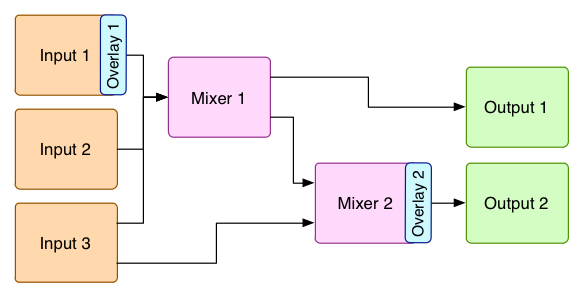

# Mixers
Mixers allow video and audio to be switched and mixed together.

A mixer can have any number of *sources*. Sources can be either [inputs](inputs.md) or the output from other mixers.

[Outputs](outputs.md) can then take a mixer as a source, to deliver its mix elsewhere (e.g. as an RTMP stream, or writing to a file).

Mixers can also have [overlays](overlays.md) applied to them.

There can be any number of mixers. They can be created, updated, and deleted using the [API](api.md). They can also be created at start-up using a [config file](config_file.md).

All together, this allows mixers to be interconnected in interesting ways, for example:

## Properties
There is only one type of mixer, and it has the following properties:

| Name | Can be set initially? | Can be updated?? | Description | Default value (if not set) |
| ---- | --------------------- | ---------------- | ----------- | -------------------------- |
| `id` | No | No | ID of the mixer. Positive integer. Starts at 1 and increases by 1 for each new mixer. | n/a  |
| `uid` | No | No | Unqiue ID - a string in the format 'mixerX' where X is the ID | n/a  |
| `state` | Yes | Yes | Either `NULL`, `READY`, `PAUSED` or `PLAYING`. [_What are the four states?_](faq.md#what-are-the-four-states) | `PLAYING` |
| `sources` | Yes | No (but can be done so via the API calls `cut_to_source` and `overlay_source`) | An array of inputs and mixers that are the source of this mixer. Each array entry is a dictionary, containing the `uid` of the source (e.g. `input1`) and also properties about how the source is being mixed. | None |
| `pattern` | Yes | Yes | The pattern used for the background, as an integer. See the [test video](inputs.md#test-video) input type for the list of available patterns. | 0 (SMPTE 100% color bars) |
| `width` and `height` | Yes | Yes | Override of the width and height | The values of `default_mixer_width` and `default_mixer_height` in the [config file](config_file.md). |
